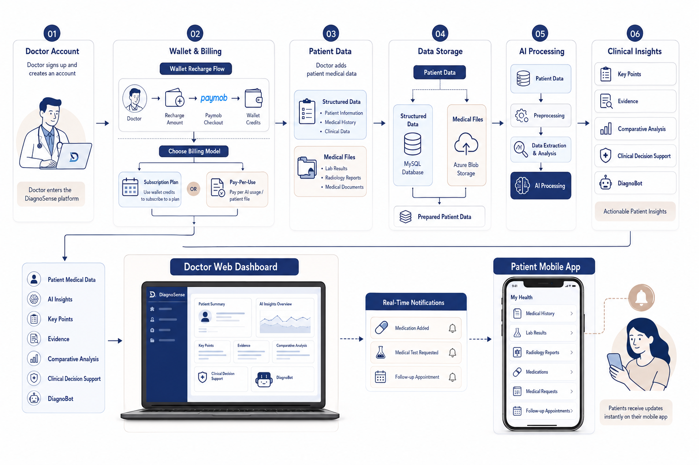

# 🩺 DiagnoSense

### AI-Powered Patient Data Analysis & Clinical Decision Support

An AI-powered Clinical Decision Support System designed to help doctors
analyze complex patient data, extract critical insights, and make faster,
more informed clinical decisions.

  
  
  
  
  
  

  
  
  
  
  

  <a href="#-demo">Demo</a> •
  <a href="#-project-resources">Resources</a> •
  <a href="#-overview">Overview</a> •
  <a href="#-key-features">Features</a> •
  <a href="#-how-it-works">How It Works</a>

 

## 🎥 Demo

https://github.com/user-attachments/assets/dbdaff63-3fd9-4e31-91bf-9832c7d12a8a

 

## 🔗 Project Resources

| Resource | Link |
|---|---|
| 📊 Presentation | [View Presentation](https://docs.google.com/presentation/d/1UKtqHuVS2AF8zNZ3gLH8zPPlaabc5fcc/edit?usp=drive_link) |
| 📚 API Documentation | [View API Documentation](https://registry.scalar.com/@default-team-mexre/apis/diagnosense-api-documentation@latest) |

 

## 📌 Overview

**DiagnoSense** is an AI-powered Clinical Decision Support System designed to
help doctors efficiently analyze complex and unstructured patient data.

Doctors often need to review large volumes of medical information, including
patient history, laboratory results, radiology reports, and other medical
documents. Manually reviewing and connecting this information can be
time-consuming and may make it difficult to identify important clinical
details.

DiagnoSense addresses this challenge by combining **AI-powered medical data
analysis, document processing, and structured patient data management** into
one integrated platform.

The system processes patient information and medical files to extract relevant
clinical insights, organize complex medical data, and provide doctors with a
clearer view of the patient's medical history.

DiagnoSense is designed to **reduce information overload, save physicians'
time, and support faster, more informed clinical decision-making**, while
keeping the physician at the center of the decision-making process.

 

## ✨ Key Features

<table>
<tr>
<th>Feature</th>
<th>Description</th>
</tr>

<tr>
<td>🎙️ <strong>Smart Patient Data Input</strong></td>
<td>
Doctors can enter patient information using <strong>Speech-to-Text</strong>,
reducing manual data entry and helping capture clinical information more
efficiently. The system also supports uploading medical files such as
laboratory results, radiology reports, and medical history documents.
</td>
</tr>

<tr>
<td>🤖 <strong>AI-Powered Medical Data Analysis</strong></td>
<td>
Analyzes patient data and medical documents to extract relevant clinical
information and transform large amounts of medical data into structured and
actionable insights.
</td>
</tr>

<tr>
<td>🔎 <strong>Key Points & Evidence</strong></td>
<td>
Highlights the most important information physicians should focus on during
clinical assessment. Through <strong>View Evidence</strong>, each insight can
be traced back to its original location within the uploaded medical document.
</td>
</tr>

<tr>
<td>🩺 <strong>Clinical Decision Support</strong></td>
<td>
Provides potential clinical insights based on the patient's medical history
and available data to support physicians during diagnosis, while keeping the
physician at the center of clinical decision-making.
</td>
</tr>

<tr>
<td>📊 <strong>Comparative Analysis</strong></td>
<td>
Compares medical test results collected over time through unified visual
representations, helping physicians quickly identify trends and evaluate
changes in the patient's condition.
</td>
</tr>

<tr>
<td>💬 <strong>DiagnoBot — Patient-Aware AI Assistant</strong></td>
<td>
Allows physicians to ask questions about a patient's medical records and
receive answers grounded in the available patient data, helping reduce
unsupported or hallucinated responses.
</td>
</tr>

<tr>
<td>💊 <strong>Patient Care & Follow-Up Management</strong></td>
<td>
Enables physicians to manage post-consultation information including
prescribed medications, requested laboratory tests, radiology examinations,
and follow-up appointments.
</td>
</tr>

<tr>
<td>🔔 <strong>Real-Time Patient Notifications</strong></td>
<td>
Sends important updates to patients through the mobile application when
physicians add medications, medical requests, or follow-up information.
</td>
</tr>

<tr>
<td>📱 <strong>Patient Mobile Application</strong></td>
<td>
Gives patients access to their medical information in one place, including
medical history, laboratory results, radiology reports, medications, medical
requests, and follow-up information.
</td>
</tr>

<tr>
<td>💳 <strong>Subscriptions & Billing</strong></td>
<td>
Provides a flexible billing system supporting <strong>wallet credits,
subscription plans, and pay-per-use billing</strong>. Doctors can recharge
their wallet, subscribe to available plans, or switch to a pay-per-use model
based on their needs.
</td>
</tr>

<tr>
<td>💰 <strong>Paymob Payment Integration</strong></td>
<td>
Integrates <strong>Paymob</strong> as the payment gateway for wallet
recharging. The system creates a payment intention, generates a checkout flow,
redirects the doctor to the payment page, and handles the resulting payment
status.
</td>
</tr>

</table>

 
## 🔄 How It Works

DiagnoSense follows an end-to-end workflow that connects the doctor's
platform, AI processing services, cloud storage, and the patient's mobile
application.

  

